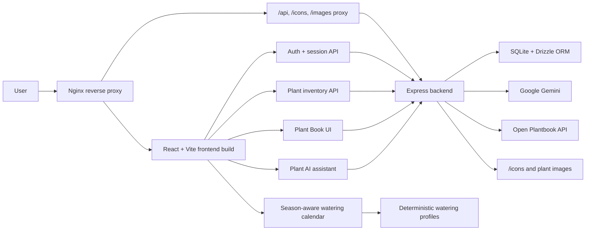

# PlantPulse

[](https://github.com/Sissighn/PlantPulse/actions/workflows/ci.yml)


PlantPulse is a comprehensive plant care management application designed to help users track watering schedules, browse plant care data, and maintain plant health. The application combines a cozy retro pixel-inspired dashboard with Open Plantbook plant data and AI integration for personalized care advice and interactive assistance.

---

## Project Overview

This project serves as a digital assistant for plant enthusiasts. It allows users to build a digital inventory of their plants, automatically calculating watering needs based on plant-specific profiles and seasonal factors. The app also includes an interactive watering calendar and a Plant Book powered by Open Plantbook, so users can search plants before buying them and inspect care data such as light, temperature, humidity, watering, soil, and fertilization. Google Gemini powers optional care tips and the conversational plant assistant.

---

## Screenshots

### Plant Management View


### Different types of plants


### AI Assistant Chat


---

## Key Features

### Plant Management

- **Inventory Tracking:** Users can add plants from a predefined list or customize their own entries.

- **User Accounts:** Registered users and guests receive separate plant inventories backed by the API.

- **Plant-Specific Scheduling:** Known plants use deterministic watering profiles, while the displayed interval adjusts by season and plant type (e.g., cactus, succulent, moisture-loving, tropical).

- **Visual Indicators:** The UI visually represents plant status (e.g., "thirsty" states, grayscale filters) to provide immediate feedback on care urgency.

- **Cozy Pixel Dashboard:** The main UI uses warm cream surfaces, forest-green accents, pixel-art assets, framed panels, and responsive sizing for a cohesive retro garden feel.

### Watering Calendar

- **Automatic Calendar Events:** Watering dates are generated from each plant's stored interval, last watered date, and the currently selected season.

- **Season-Aware Planning:** Switching seasons recalculates future watering dates immediately.

- **Interactive Day Details:** Calendar days expose detailed watering tasks for the plants due on that date.

- **User Settings:** Users can choose whether the calendar week starts on Monday or Sunday.

### Plant Book

- **Open Plantbook Search:** Users can search the Open Plantbook database from inside the app.

- **Real Plant Images:** Search results are enriched with actual plant images from Open Plantbook detail records, making visual identification easier.

- **Care Details:** Plant detail pages show available data for temperature, light, soil moisture, air humidity, watering, sunlight, soil, fertilization, pruning, and origin.

- **Add From Plant Book:** Users can add a discovered plant directly to their personal inventory.

- **Robust UX States:** Search uses debouncing, skeleton loading states, retry UI, missing-data guidance, and a success toast after adding a plant.

### AI Integration

- **Contextual Care Tips:** Users can generate specific, concise care instructions (Watering, Light, Fertilizer) for any plant directly from the dashboard.

- **Interactive Chatbot:** A dedicated AI assistant allows users to ask complex questions regarding plant health and diagnosis.

- **Image Analysis:** Support for image-based queries, allowing users to upload context for the AI to analyze.

- **Safety Boundaries:** AI responses are framed as care guidance rather than guaranteed diagnoses, with extra caution around toxicity, pets, children, and uncertain image analysis.

---

## Technical Implementation

- **Modern Frontend:** Built with React and Vite for high performance, utilizing Tailwind CSS for a responsive, clean design.

- **Robust Backend:** Node.js and Express server handling API requests, managing a local SQLite database for persistence.

- **Authentication:** Email/password login uses server-side password hashing and an HTTP-only JWT cookie; guest sessions stay isolated from registered accounts.

- **Accessibility:** Icon buttons use accessible labels, dialogs provide modal semantics, and interactive overlays support Escape-to-close and focus management.

- **Internationalization:** German and English UI strings are managed through i18next, including the assistant, settings, Plant Book, and calendar flows.

- **Pixel Asset Integration:** Static PNG assets for seasonal icons, frames, watering states, and decorative dashboard elements are served from the backend `/icons` route.

- **Open Plantbook Proxy:** The backend handles Open Plantbook OAuth credentials, token refresh, response caching, search, and detail lookups so secrets never reach the browser.

- **API Integration:** Seamless connection with Google Gemini for natural language processing and content generation.

- **Deployment-Ready Reverse Proxy:** The Docker production setup serves the React build through Nginx, proxies `/api`, `/icons`, and `/images` to the backend, and applies cache, compression, and security headers.

- **Health Checks:** Backend `/healthz` and `/readyz` endpoints support container orchestration; Docker Compose waits for a healthy backend before starting the frontend.

---

## Architecture



The frontend owns presentation, i18n, accessibility states, and user interactions. The backend keeps secrets server-side, handles authentication, persists plant inventory, proxies Open Plantbook, and applies AI safety prompts before calling Gemini.

---

## Deployment Architecture

During local development, the app can run as two separate dev servers: Vite serves the frontend on `http://localhost:5173`, and Express serves the backend on `http://localhost:3000`.

For the Docker production-style setup, Nginx becomes the single public entry point at `http://localhost`. It serves the compiled React app and forwards backend-related requests internally:

- `/api/*` -> Express backend
- `/icons/*` -> backend static icon assets
- `/images/*` -> backend plant image assets

This is different from the earlier setup, where the frontend container only served static files and the browser still had to call the backend directly on `localhost:3000`. That worked locally, but it was less representative of a real deployment because the frontend and API behaved like two separate public services.

The current setup is closer to a production architecture:

- **Single origin:** The browser can load the app and call the API from the same host, reducing CORS and cookie complexity.
- **Reverse proxy:** Nginx routes API and asset requests to the backend without exposing backend internals to the frontend bundle.
- **Security headers:** Nginx adds browser-facing headers for the static frontend.
- **Caching:** Hashed build assets are cached long-term, while `index.html` stays fresh.
- **Compression:** gzip and Brotli reduce transferred CSS/JS size.
- **Health checks:** Docker Compose can detect whether frontend and backend containers are actually healthy.
- **Startup ordering:** The frontend waits until the backend readiness check passes.

Everything still runs locally unless deployed elsewhere. Docker Compose exposes the app at `http://localhost`; no cloud service is used by default.

---

## Project Structure

The project is organized into a clear separation of concerns between the client (frontend) and server (backend).

```
PLANTPULSE
├── backend
│   ├── config
│   │   └── gemini.js           # AI Model configuration
│   ├── controllers
│   │   ├── plantBookController.js # Open Plantbook request handling
│   │   └── plantController.js     # Plant inventory request handling
│   ├── db
│   │   ├── database.js         # Database connection setup
│   │   └── schema.js           # Drizzle ORM schema
│   ├── middleware
│   │   ├── errorHandler.js     # Central Express error handling
│   │   └── validateRequest.js  # Zod request validation middleware
│   ├── domain
│   │   └── wateringProfiles.js # Deterministic plant watering profiles
│   ├── public
│   │   ├── icons               # Pixel-art icons, frames, and decorative UI assets
│   │   └── plantImages         # Uploaded plant imagery
│   ├── routes
│   │   └── plantRoutes.js      # API endpoint definitions
│   ├── services
│   │   ├── aiService.js        # Logic for AI prompts and formatting
│   │   ├── openPlantbookService.js # Open Plantbook API client/proxy
│   │   └── plantService.js     # Business logic for plant data
│   ├── app.js                  # Express app setup
│   ├── server.js               # Server entry point
│   ├── tsconfig.json           # TypeScript checking configuration
│   └── .env.example            # Environment variable template
│
└── frontend
    ├── e2e
    │   └── plant-care.spec.ts  # Playwright user journey tests
    ├── src
    │   ├── components
    │   │   ├── AddPlantForm.jsx
    │   │   ├── FluidMenu.jsx
    │   │   ├── PlantCardContainer.jsx
    │   │   ├── PlantCardView.jsx
    │   │   ├── PlantBook.jsx
    │   │   ├── PlantSelectContainer.jsx
    │   │   ├── PlantSelectView.jsx
    │   │   ├── SettingsModal.jsx
    │   │   ├── SeasonSelector.jsx
    │   │   └── WateringCalendar.jsx
    │   ├── domain
    │   │   ├── wateringCalendar.ts
    │   │   ├── plantStatus.ts
    │   │   ├── wateringProfiles.ts
    │   │   └── wateringSchedule.ts
    │   ├── hooks
    │   │   ├── useNotifications.js
    │   │   └── usePlantStatus.js
    │   ├── features
    │   │   ├── pixelBot/
    │   │   └── plantAssistant/
    │   ├── locales
    │   │   ├── de/
    │   │   └── en/
    │   ├── App.jsx                 # Main application layout
    │   ├── i18n.js                 # Internationalization setup
    │   ├── constants.ts            # Global configuration
    │   └── main.jsx                # React entry point
    ├── playwright.config.ts
    ├── tailwind.config.js
    ├── tsconfig.json
    └── vite.config.js
```

---

## Tech Stack

- **Frontend:** React, Vite, TypeScript, Tailwind CSS, Lucide React

- **Backend:** Node.js, Express.js, TypeScript type checking

- **Database:** SQLite with Drizzle ORM

- **Plant Data:** Open Plantbook API

- **AI:** Google Gemini API

---

## Roadmap & Future Development

- **Notification System:** Implementation of push notifications or emails to remind users when watering is overdue.

- **Advanced Image Recognition:** Enhancing the AI's ability to automatically identify plant species and diagnose diseases from uploaded photos.

- **Enhanced Chatbot Context:** Improving the chatbot's memory to reference previous interactions and specific plant history.

- **Expanded Pixel Asset Set:** Replace CSS fallback decorations with final transparent frame and footer assets where desired.

---

## Installation & Setup

### Prerequisites

- Node.js 20+
- npm 10+

### Clone the repository

```bash
git clone <repository-url>
cd plantpulse
```

### Environment variables (Backend)

Use [backend/.env.example](backend/.env.example) as the template and create a local `backend/.env`:

```bash
cp backend/.env.example backend/.env
```

Then fill in:

```env
GEMINI_API_KEY=your_api_key_here
JWT_SECRET=replace_with_at_least_32_random_bytes
FRONTEND_ORIGINS=http://localhost:5173,http://localhost

# Open Plantbook credentials stay server-side.
OPEN_PLANTBOOK_CLIENT_ID=your_client_id_here
OPEN_PLANTBOOK_CLIENT_SECRET=your_client_secret_here
```

Generate a long `JWT_SECRET` before deploying, for example with `openssl rand -hex 32`. In production the backend refuses to start if `JWT_SECRET` is shorter than 32 bytes.

Open Plantbook uses OAuth client credentials. Prefer `OPEN_PLANTBOOK_CLIENT_ID` and `OPEN_PLANTBOOK_CLIENT_SECRET`; the backend caches and refreshes access tokens automatically. A pre-generated bearer token can also be supplied with `OPEN_PLANTBOOK_ACCESS_TOKEN`, but it may expire and should not be committed.

Never commit `backend/.env`; it is intentionally ignored by Git.

### Docker Setup (Recommended)

You can run the entire application with a single command using Docker. This starts an Express backend container and an Nginx frontend container. Nginx serves the React build and proxies `/api`, `/icons`, and `/images` to the backend.

**Prerequisites:**
- Docker and Docker Compose installed.

**Run with Docker Compose:**
```bash
# Build and start the containers in the background
docker compose up -d --build
```

The application will be available at:
- **App:** http://localhost
- **API through Nginx:** http://localhost/api
- **Backend health check:** http://localhost:3000/readyz

To stop the application:
```bash
docker compose down
```

---

### Manual Local Setup

#### Backend Setup

```bash
cd backend
npm install
npm start
```

Alternative (watch mode):

```bash
npm run dev
```

### Frontend Setup

```bash
cd frontend
npm install
npm run dev
```

## Known Limitations

- **AI guidance is advisory:** Plant AI can suggest care steps, but it does not provide guaranteed diagnoses and should not replace expert advice for toxicity, pet safety, or severe plant disease concerns.
- **Open Plantbook data varies:** Some plants have incomplete care details or missing images, so the UI includes missing-data guidance and fallback states.
- **Local SQLite by default:** The default setup is ideal for local development and portfolio review. Production deployments should configure persistent storage and backup strategy.
- **Calendar is rule-based:** Watering events are calculated from stored intervals, plant profiles, and selected season. Microclimate, pot size, soil mix, and plant condition still require user judgment.
- **Push notifications are not implemented yet:** In-app notifications exist, but email/push reminders are listed as future work.

---

## Troubleshooting

- If you see `pm run dev: command not found`, use `npm run dev`.
- If frontend shows "Backend offline", make sure backend is running on `http://localhost:3000`.
- If AI features fail, verify `GEMINI_API_KEY` in your local `backend/.env`.
- If Plant Book search or details fail, verify `OPEN_PLANTBOOK_CLIENT_ID` and `OPEN_PLANTBOOK_CLIENT_SECRET` in your local `backend/.env`, then restart the backend.
- If Plant Book details return `HTTP 401`, remove an expired `OPEN_PLANTBOOK_ACCESS_TOKEN` and use the client credentials instead.

---

## License

MIT License © 2026 Setayesh Golshan. See [LICENSE](LICENSE).
