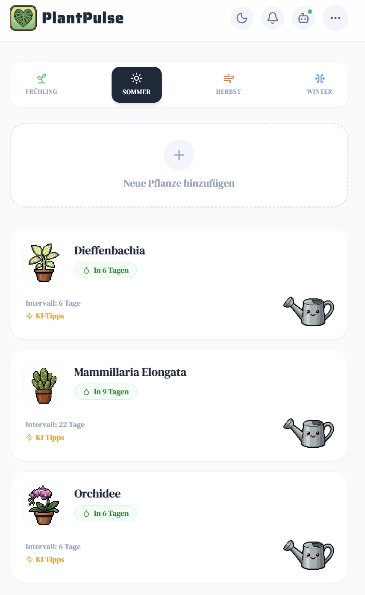
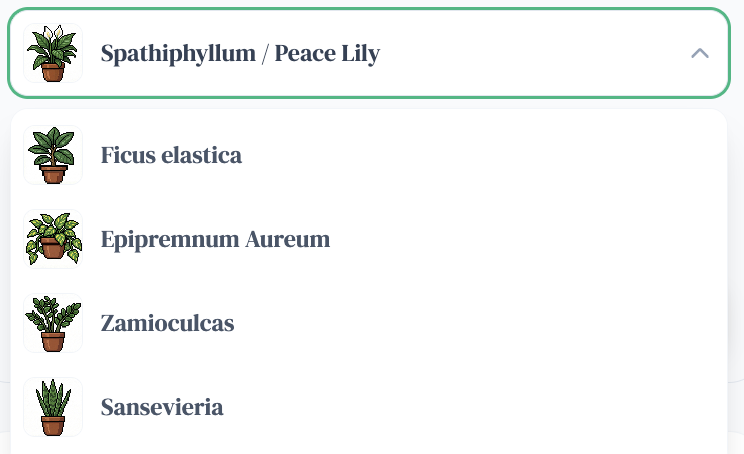
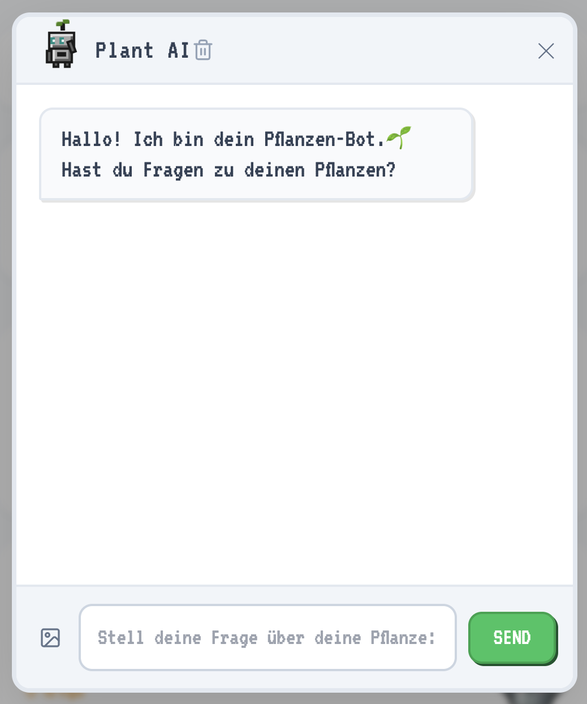

# PlantPulse


PlantPulse is a comprehensive plant care management application designed to help users track watering schedules and maintain plant health. The application combines a traditional task-management interface with advanced AI integration to provide personalized care advice and interactive assistance.

---

## Project Overview

This project serves as a digital assistant for plant enthusiasts. It allows users to build a digital inventory of their plants, automatically calculating watering needs based on seasonal factors. The latest update introduces a conversational AI interface powered by the Google Gemini API, enabling users to receive instant care tips and troubleshoot plant issues through a chat interface.

---

## Screenshots

### Plant Management View



### Different types of plants



### AI Assistant Chat



---

## Key Features

### Plant Management

- **Inventory Tracking:** Users can add plants from a predefined list or customize their own entries.

- **Dynamic Scheduling:** Watering intervals automatically adjust based on the current season (e.g., more frequent watering in summer, less in winter).

- **Visual Indicators:** The UI visually represents plant status (e.g., "thirsty" states, grayscale filters) to provide immediate feedback on care urgency.

### AI Integration

- **Contextual Care Tips:** Users can generate specific, concise care instructions (Watering, Light, Fertilizer) for any plant directly from the dashboard.

- **Interactive Chatbot:** A dedicated AI assistant allows users to ask complex questions regarding plant health and diagnosis.

- **Image Analysis:** Support for image-based queries, allowing users to upload context for the AI to analyze.

---

## Technical Implementation

- **Modern Frontend:** Built with React and Vite for high performance, utilizing Tailwind CSS for a responsive, clean design.

- **Robust Backend:** Node.js and Express server handling API requests, managing a local SQLite database for persistence.

- **API Integration:** Seamless connection with Google Gemini for natural language processing and content generation.

---

## Project Structure

The project is organized into a clear separation of concerns between the client (frontend) and server (backend).

```
PLANTPULSE
├── backend
│   ├── config
│   │   └── gemini.js           # AI Model configuration
│   ├── controllers
│   │   └── plantController.js  # Request logic handling
│   ├── db
│   │   ├── database.js         # Database connection setup
│   │   └── plants.db           # SQLite storage
│   ├── public
│   │   ├── icons               # Static assets
│   │   └── plantImages         # Uploaded plant imagery
│   ├── routes
│   │   └── plantRoutes.js      # API endpoint definitions
│   ├── services
│   │   ├── aiService.js        # Logic for AI prompts and formatting
│   │   └── plantService.js     # Business logic for plant data
│   ├── app.js                  # Express app setup
│   ├── server.js               # Server entry point
│   └── .env                    # Environment variables
│
└── frontend
    ├── src
    │   ├── components
    │   │   ├── AddPlantForm.jsx
    │   │   ├── PlantCardContainer.jsx
    │   │   ├── PlantCardView.jsx
    │   │   ├── PlantSelectContainer.jsx
    │   │   ├── PlantSelectView.jsx
    │   │   └── SeasonSelector.jsx
    │   ├── domain
    │   │   ├── plantStatus.js
    │   │   └── wateringSchedule.js
    │   ├── hooks
    │   │   ├── useNotifications.js
    │   │   └── usePlantStatus.js
    │   ├── features
    │   │   ├── pixelBot/
    │   │   └── plantAssistant/
    │   ├── locales
    │   │   ├── de/
    │   │   └── en/
    │   ├── App.jsx                 # Main application layout
    │   ├── i18n.js                 # Internationalization setup
    │   ├── constants.js            # Global configuration
    │   └── main.jsx                # React entry point
    ├── tailwind.config.js
    └── vite.config.js
```

---

## Tech Stack

- **Frontend:** React, Vite, Tailwind CSS, Lucide React

- **Backend:** Node.js, Express.js

- **Database:** SQLite / JSON-based persistence

- **AI:** Google Gemini API

---

## Roadmap & Future Development

- **Notification System:** Implementation of push notifications or emails to remind users when watering is overdue.

- **Advanced Image Recognition:** Enhancing the AI's ability to automatically identify plant species and diagnose diseases from uploaded photos.

- **User Authentication:** Adding multi-user support to allow cloud-based synchronization across devices.

- **Enhanced Chatbot Context:** Improving the chatbot's memory to reference previous interactions and specific plant history.

---

## Installation & Setup

### Prerequisites

- Node.js 20+
- npm 10+

### Clone the repository

```bash
git clone <repository-url>
cd plantpulse
```

### Environment variables (Backend)

Create [backend/.env](backend/.env) with:

```env
GEMINI_API_KEY=your_api_key_here
```

### Backend Setup

```bash
cd backend
npm install
npm start
```

Alternative (watch mode):

```bash
npm run dev
```

### Frontend Setup

```bash
cd frontend
npm install
npm run dev
```

## Troubleshooting

- If you see `pm run dev: command not found`, use `npm run dev`.
- If frontend shows "Backend offline", make sure backend is running on `http://localhost:3000`.
- If AI features fail, verify `GEMINI_API_KEY` in [backend/.env](backend/.env).

---

## License

MIT License © 2026 Setayesh Golshan
